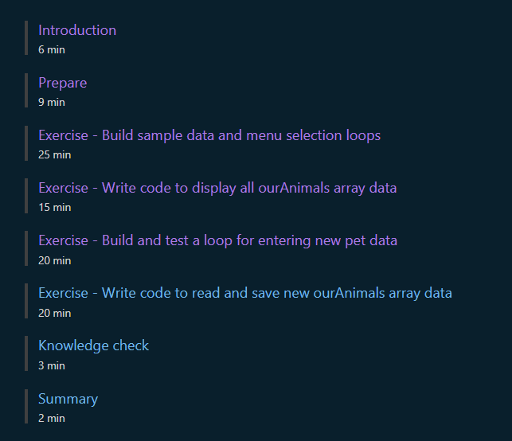

# [Guided project - Develop conditional branching and looping structures in C#](https://learn.microsoft.com/en-gb/training/modules/guided-project-develop-conditional-branching-looping/)

This unit is part of module:  [Add logic to C# console applications (Get started with C#, Part 3)](https://learn.microsoft.com/en-gb/training/paths/get-started-c-sharp-part-3/) 
In the ["Learn C#" Official Collection](https://learn.microsoft.com/en-us/users/dotnet/collections/yz26f8y64n7k07)

## Description

Gain experience developing a console app that implements selection and iteration statements to achieve app specifications.

Learning objectives:
In this module, you'll practice how to:

* Use Visual Studio Code to develop a C# console application that uses a combination of selection and iteration statements to implement logical workflows in accordance with supplied application data and user interactions.
* Evaluate the underlying conditions and make an informed decision when choosing between if-elseif-else and switch statements, and between foreach, for, while, and do iteration statements.
* Scope variables at an appropriate level within an application.

